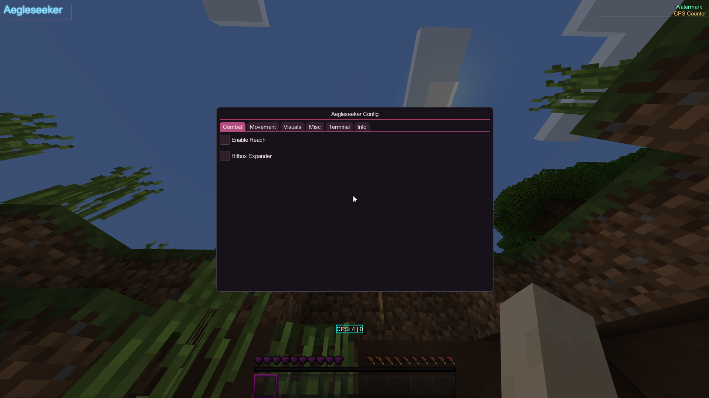

# Aegleseeker
  
A DirectX 11 internal hook with an ImGui interface for runtime client modification. This project provides a modular DLL payload with in-game feature toggles, a command terminal, and JSON-based config persistence.

<p align="center">
  
</p>

<p align="center">
  
  
  
  
  
</p>

## Overview

Aegleseeker is an internal client modification framework that hooks into DirectX 11 applications. It provides:

- **DirectX 11 Integration**: Full D3D11 hook for frame-level access
- **ImGui Interface**: Modern, draggable UI for in-game menu
- **Modular Architecture**: Well-organized feature modules (Combat, Movement, Visuals, Misc)
- **Centralized Animation System**: Unified easing functions and animation utilities
- **Advanced Features**:
  - Reach/Hitbox modifications
  - AutoSprint functionality
  - Motion Blur effects
  - Keystrokes display with CPS counter
  - Render information overlay
  - FullBright mode
  - Frame rate control (Unlock FPS)
  - Watermark display
  - Timer modifications
  
## Requirements

### System
- Windows 10 or later (x64)
- DirectX 11 compatible GPU
- Visual Studio 2015+ or MinGW-w64

### Build Dependencies
- **Compiler**:
  - MSVC (Visual Studio 2015+) OR
  - GCC/MinGW (MinGW-w64 recommended)
- **Windows SDK** (for DirectX 11 headers)
- **Dependencies**:
  - DirectX 11 SDK libraries
  - ImGui (included)
  - MinHook (included)

## Building

### Using PowerShell (recomended)

```powershell
.\build.ps1
```

This generates the DLL in `build/` directory.

## Project Structure

```
aegledll/
│   build.ps1
│   dllmain.cpp
│   README.md
│   
├───Animations
│       Animations.cpp
│       Animations.hpp
│       
├───Assets
│   │   clicksound.mp3
│   │   clicksound_1.mp3
│   │   clicksound_2.mp3
│   │   logo.png
│   │   resource.h
│   │   resources.rc
│   │   
│   └───stb
│           stb_image.h
│           stb_image_impl.cpp
│           
├───Config
│       ConfigManager.cpp
│       ConfigManager.hpp
│       
├───GUI
│   │   GUI.cpp
│   │   GUI.hpp
│   │   
│   └───DX11
│           ImGuiRenderer.cpp
│           ImGuiRenderer.hpp
│           
├───Hook
│       Hook.cpp
│       Hook.hpp
│       
├───ImGui
│   │   imconfig.h
│   │   imgui.cpp
│   │   imgui.h
│   │   imgui_demo.cpp
│   │   imgui_draw.cpp
│   │   imgui_internal.h
│   │   imgui_tables.cpp
│   │   imgui_widgets.cpp
│   │   imstb_rectpack.h
│   │   imstb_textedit.h
│   │   imstb_truetype.h
│   │   
│   ├───backend
│   │       imgui_impl_dx11.cpp
│   │       imgui_impl_dx11.h
│   │       imgui_impl_win32.cpp
│   │       imgui_impl_win32.h
│   │       
│   └───imgui-markdown
│           imgui-markdown.h
│           
├───Input
│       Input.cpp
│       Input.hpp
│       
├───minhook
│       buffer.c
│       buffer.h
│       hde32.c
│       hde32.h
│       hde64.c
│       hde64.h
│       hook.c
│       MinHook.def
│       MinHook.h
│       MinHook.rc
│       pstdint.h
│       table32.h
│       table64.h
│       trampoline.c
│       trampoline.h
│       
├───miniaudio
│       miniaudio.h
│       
├───Modules
│   │   Globals.hpp
│   │   ModuleHeader.hpp
│   │   ModuleManager.cpp
│   │   ModuleManager.hpp
│   │   
│   ├───Alloc
│   │       AllocateNear.cpp
│   │       AllocateNear.hpp
│   │       
│   ├───Combat
│   │   ├───Hitbox
│   │   │       Hitbox.cpp
│   │   │       Hitbox.hpp
│   │   │       
│   │   └───Reach
│   │           Reach.cpp
│   │           Reach.hpp
│   │           
│   ├───Info
│   │       Info.cpp
│   │       Info.hpp
│   │       
│   ├───Misc
│   │   └───UnlockFPS
│   │           UnlockFPS.cpp
│   │           UnlockFPS.hpp
│   │           
│   ├───Movement
│   │   ├───AutoSprint
│   │   │       AutoSprint.cpp
│   │   │       AutoSprint.hpp
│   │   │       
│   │   └───Timer
│   │           Timer.cpp
│   │           Timer.hpp
│   │           
│   ├───PatternScan
│   │       PatternScan.cpp
│   │       PatternScan.hpp
│   │       
│   ├───Terminal
│   │       Terminal.cpp
│   │       Terminal.hpp
│   │       
│   └───Visuals
│       ├───CPSCounter
│       │       CPSCounter.cpp
│       │       CPSCounter.hpp
│       │       
│       ├───FullBright
│       │       FullBright.cpp
│       │       FullBright.hpp
│       │       
│       ├───Keystrokes
│       │   │   Keystrokes.cpp
│       │   │   Keystrokes.hpp
│       │   │   
│       │   └───Helper
│       │           HelperFunctions.hpp
│       │           
│       ├───MotionBlur
│       │       MotionBlur.cpp
│       │       MotionBlur.hpp
│       │       
│       ├───RenderInfo
│       │       RenderInfo.cpp
│       │       RenderInfo.hpp
│       │       
│       └───Watermark
│               Watermark.cpp
│               Watermark.hpp
│               
├───nlohmann
│       json.hpp
│       
└───Utils
        HudElement.hpp
```

## Features

### Combat
- **Reach**: Modify entity interaction distance
- **Hitbox**: Extend target collision boxes
- **Smart detection**: Automatic animation-aware hitbox scaling

### Movement
- **AutoSprint**: Continuous sprint without interaction
- **Timer**: Frame time multiplier for speed modifications
- **FullBright**: Enhanced visibility in dark areas
- **Unlock FPS**: Remove frame rate limitations

### Visuals
- **Motion Blur**: GPU-accelerated blur effects with multiple modes
- **Render Info**: Real-time FPS and performance metrics
- **Keystrokes**: Display keyboard inputs with CPS counter
- **Watermark**: Customizable watermark overlay
- **ArrayList**: Module status display with smooth animations

### UI Features
- **Draggable Windows**: Move all UI elements with mouse
- **Tabbed Interface**: Organized settings by category
- **Smooth Animations**: Easing functions for visual polish
- **Real-time Updates**: Live value adjustments during gameplay

## Usage

1. **Compile** the project using PowerShell script
2. **Inject** `internal_hook.dll` into a DirectX 11 application
3. **Press INSERT** key to toggle the menu
4. **Configure** features via the tabbed interface
5. **Customize** window positions by dragging

### Keyboard Shortcuts
- **INSERT**: Toggle main menu
- **Drag windows**: Left mouse button when menu is open

## Technical Details

### DirectX 11 Hooking
The project hooks `IDXGISwapChain::Present()` and `ResizeBuffers()` to intercept rendering. ImGui is initialized with DX11 backend for native rendering without performance overhead.

### Input Handling
- Manual input system for compatibility
- Virtual key mapping to ImGui keys
- Character input for IME support
- Mouse and keyboard state tracking

### Animation System
- **Centralized Framework**: All easing functions in `Animations` namespace
- **Easing Functions**: Cubic, quadratic, exponential, and elastic easing
- **Animation Utilities**: Progress calculation and value clamping
- **Thread-Safe Design**: Static methods for safe concurrent access
- **Smooth Transitions**: Configurable duration and interpolation

## Build System

This project uses the included PowerShell build script:

- `build.ps1`: PowerShell build script using `g++`

### Source Organization
- **Core Sources**: Main application logic and module implementations
- **ImGui Sources**: GUI framework implementation
- **Backend Sources**: Platform-specific ImGui backends (DX11, Win32)
- **MinHook Sources**: API hooking library

### Module Structure
Features are organized in a hierarchical module system:
- `Modules/Combat/`: Combat modifications (Hitbox, Reach)
- `Modules/Movement/`: Movement enhancements (AutoSprint, Timer)
- `Modules/Visuals/`: Visual features (MotionBlur, Keystrokes, etc.)
- `Modules/Misc/`: Miscellaneous utilities (UnlockFPS)

### Dependencies
- **ImGui**: Included as source files
- **MinHook**: Lightweight API hooking library
- **DirectX 11**: Windows graphics API
- **Windows SDK**: System libraries and headers

## Dependencies

### External Libraries (Included)
- **ImGui**: Immediate-mode GUI library
- **MinHook**: Minimalist API hooking library

### System Libraries
- **d3d11.lib**: Direct3D 11
- **dxgi.lib**: DXGI for swap chain
- **d3dcompiler.lib**: HLSL shader compilation
- **dwmapi.lib**: Desktop Window Manager
- **user32.lib**: Windows API
- **gdi32.lib**: Graphics Device Interface
- **psapi.lib**: Process API

## Platform Support

- **OS**: Windows 10+ (x64)
- **Compilers**: MSVC 2015+, MinGW-w64
- **Architecture**: x86-64 only
- **Graphics**: DirectX 11

## Known Limitations

- x64 builds only (x86 not supported)
- DirectX 11 applications only
- Windows platform only
- Requires administrative privileges for injection
- Animation system tied to frame timing

## Building on Different Compilers

### Visual Studio
- Build using the included build script or your preferred MSVC workflow.

### MinGW-w64
- Use `build.ps1` and ensure `g++` is installed.

## Troubleshooting

| Issue | Solution |
|-------|----------|
| DLL fails to load | Ensure target app is x64 and uses DirectX 11 |
| Menu doesn't appear | Press INSERT key, check if app has focus |
| Rendering artifacts | Update graphics drivers |
| Performance issues | Disable motion blur or reduce FPS limit |
| Build failures | Install Windows SDK and verify compiler setup |

## License

This project is licensed under the [MIT license](LICENSE)

## Disclaimer

This software is provided for educational purposes only. Unauthorized modification of third-party applications may violate terms of service or applicable laws. Users are responsible for compliance with applicable regulations and terms of service of the target application.

## Contributing

Contributions are welcome. Please ensure code follows the existing style and includes appropriate comments.

## Support

For issues, questions, or feature requests, please open an issue on the repository.

Discord: notvyzer

---

**Last Updated**: April 4, 2026  
**Status**: Active Development
